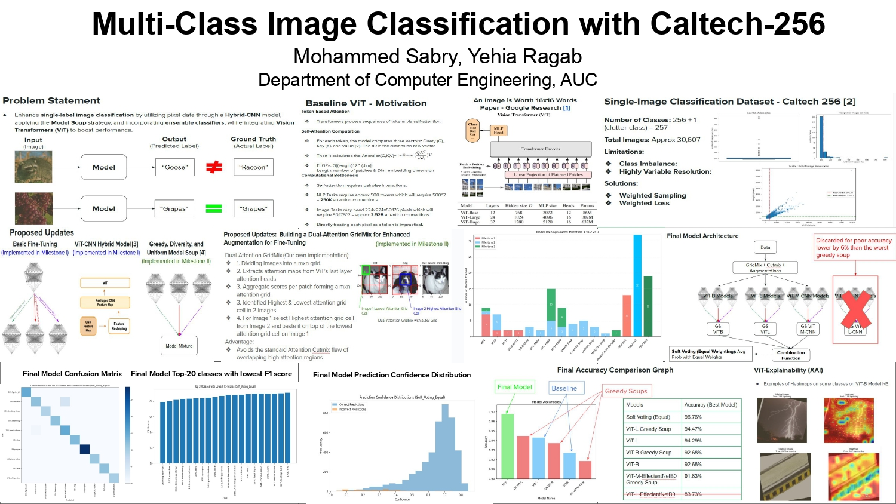

# Vision Transformer Hybrid Architectures for Image Classification on Caltech-256

A comparative study of Vision Transformer (ViT) hybrid architectures, ensemble methods, and self-supervised pretraining for image classification on the Caltech-256 dataset (257 classes).

## Project Poster

<p align="center">
  
</p>

## Project Structure

```
.
├── ViT-M-CNN/          # Hybrid ViT-Medium + EfficientNet-B0 with GridMix augmentation
├── ViT-L-CNN/          # Hybrid ViT-Large + EfficientNet-B0 & standalone ViT-Large fine-tuning
├── MAE/                # Masked Autoencoder pretraining + fine-tuning
├── Soups/              # Model Soups (uniform, greedy, diversity, weighted, prediction)
├── EL/                 # Ensemble Learning (voting, meta-learner, PPO-based weighting)
└── requirements.txt
```

## Approaches

### 1. ViT-M-CNN — Custom Hybrid Architecture (`ViT-M-CNN/`)

A custom hybrid model that uses **EfficientNet-B0** as a CNN feature extractor, projecting spatial features into a **custom ViT-Medium encoder** (18 layers, 896 hidden dim, 14 attention heads).

Key features:
- **GridMix**: A novel attention-guided CutMix augmentation that replaces the least-attended grid region of one image with the most-attended region from another
- Focal Loss, Class-Balanced Loss, and Label Smoothing support
- Weighted random sampling for class imbalance
- Mixed-precision training with gradient scaling

### 2. ViT-L-CNN — Large-Scale Hybrid & Standalone ViT-Large (`ViT-L-CNN/`)

Two models in one notebook:
- **Cell 1 — ViT-L-CNN Hybrid**: EfficientNet-B0 + ViT-Large (24 layers, 1024 hidden dim, 16 heads) with progressive layer unfreezing via cosine annealing warm restarts
- **Cell 2 — Standalone ViT-Large**: Fine-tuning `google/vit-large-patch16-224-in21k` with a classification head

Key features:
- Dynamic dropout scheduling (increases over training)
- Progressive CNN and ViT layer unfreezing
- Gradient accumulation for effective batch size of 256
- Separate learning rates for CNN and ViT components

### 3. MAE — Masked Autoencoder Pretraining (`MAE/`)

Self-supervised pretraining using Masked Autoencoders, followed by supervised fine-tuning.

- 75% random patch masking during pretraining
- Reconstruction loss on masked patches
- Visualization of original vs. masked vs. reconstructed images
- Fine-tuning with the same augmentation and loss function toolkit

### 4. Model Soups (`Soups/`)

Implements five model soup strategies for combining multiple trained ViT-Base checkpoints:

| Strategy | Description |
|----------|-------------|
| **Uniform Soup** | Simple average of all model weights |
| **Greedy Soup** | Iteratively adds models that improve validation performance |
| **Diversity Soup** | Selects models that maximize prediction diversity |
| **Weighted Soup** | Learns optimal per-model weights |
| **Prediction Soup** | Averages model predictions (output-level ensemble) |

### 5. Ensemble Learning (`EL/`)

Compares multiple ensemble strategies across three base models (ViT-B, ViT-L, ViT-M-CNN):

- **Majority Voting** and **Soft Voting** (equal & weighted)
- **Meta-Learner**: A neural network trained to combine base model predictions
- **PPO Ensemble**: A Proximal Policy Optimization agent that dynamically weights model contributions

Best result: **Soft Voting (Weighted) — 96.73% test accuracy, 96.83% macro F1**

## Dataset

**Caltech-256** (257 object categories, ~30K images). The dataset is automatically downloaded via [KaggleHub](https://github.com/Kaggle/kagglehub). You need a Kaggle account and API token configured.

```bash
pip install kagglehub
```

A shared `split_indices.pkl` file is included to ensure consistent train/val/test splits (70/15/15) across all experiments.

## Requirements

- Python 3.9+
- CUDA-capable GPU (NVIDIA)
- 8+ GB VRAM (16+ GB recommended for ViT-Large models)

Install dependencies:

```bash
pip install -r requirements.txt
```

## Usage

Each subfolder contains a `main.ipynb` notebook. Open in Jupyter or VS Code and run the cells sequentially.

```bash
jupyter notebook ViT-M-CNN/main.ipynb
```

### Configuration

Each notebook has a `config` dictionary at the bottom of the main code cell where you can adjust:
- `batch_size` — reduce if running out of VRAM
- `lr`, `weight_decay` — learning rate and regularization
- `num_epochs`, `patience` — training duration and early stopping
- `loss_type` — choose between `'focal'`, `'class_balanced'`, or `'label_smoothing'`
- `load_checkpoint` — set to `True` to resume from a saved checkpoint

### Notes

- ViT-Large models are very VRAM intensive. Reduce `batch_size` significantly (e.g., 8-12) if needed.
- Checkpoints are saved to a `checkpoints/` directory inside each subfolder.
- Training logs and loss curves are saved as CSV and PNG files alongside checkpoints.

## Results Summary

| Model | Test Accuracy | Test Macro F1 |
|-------|--------------|---------------|
| ViT-M-CNN Hybrid | 91.83% | — |
| ViT-B (fine-tuned) | 92.68% | — |
| ViT-L (fine-tuned) | 94.29% | — |
| ViT-L (Greedy Soup) | 94.47% | — |
| Ensemble (Equal Soft Voting) | **96.76%** | **96.83%** |

## License

This project was developed for academic purposes.
